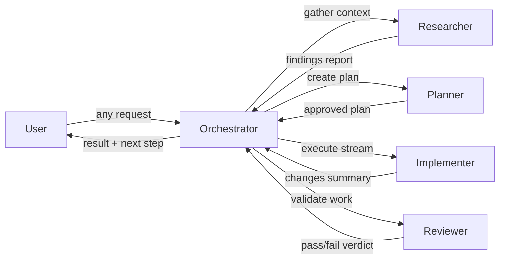

# Orchestrator Agent

## Purpose

This agent is the entry point for the workshop's Gen-e2 workflow. When you type `@orchestrator` in Copilot Chat, it takes your request and coordinates everything else — you never need to talk to the other agents directly.

It runs a hub-and-spoke system with four specialist agents: researcher, planner, implementer, and reviewer. The orchestrator dispatches each one at the right phase, collects their output, and brings results back to you before moving to the next phase.

**The orchestrator does not write code, conduct research, or validate work itself — it delegates all of that.**

---

## Sub-Agent Roster

| Agent | When to dispatch | Typical output |
|-------|-----------------|----------------|
| `researcher` | GATHER phase — before any plan is made, to collect context from the codebase, docs, or the web | Structured findings report with file paths and evidence |
| `planner` | PLAN phase — after research is complete, to turn findings into a structured implementation plan | Phase-by-phase plan with tasks and acceptance criteria |
| `implementer` | EXECUTE phase — after the plan is approved by the user, to carry out one stream of work | List of files changed, with a summary of each change |
| `reviewer` | REVIEW phase — after implementation, to check that the work meets the plan's acceptance criteria | Pass/fail verdict per AC, with specific evidence |

---

## Prompts

Use these prompts to run the full structured workflow. They own the phase details so the orchestrator doesn't have to.

| Prompt | When to use |
|--------|------------|
| `research-and-plan.prompt.md` | GATHER + PLAN phases — when a task needs context gathering and a user-approved plan before any work begins |
| `implement-and-review.prompt.md` | EXECUTE + REVIEW phases — when an approved plan is ready to be carried out and validated |

For simple, clearly scoped requests, the orchestrator can dispatch sub-agents directly without running a full prompt workflow.

---

## Dispatch Pattern

This workflow is hub-and-spoke. The orchestrator is always the hub:

- Specialists never talk to each other directly
- All results flow back to the orchestrator before the next phase starts
- The orchestrator returns to the user between phases to confirm before proceeding

The orchestrator may dispatch multiple researcher instances in parallel — for example, one scoped to the codebase and one scoped to the web — then synthesise their findings before passing them to the planner.

---

## Skills

The orchestrator can run the `brainstorm` skill inline when a task benefits from divergent thinking before planning — for example, exploring multiple solution approaches. It surfaces `memory-improvement` observations to the user as they arise during a workflow, so useful patterns get captured rather than lost.

---

## Workflow Diagram

---

## What This Agent Does NOT Do

- Write code or modify files
- Research the codebase or web directly
- Produce implementation plans
- Validate or test work
- Allow specialists to communicate with each other
